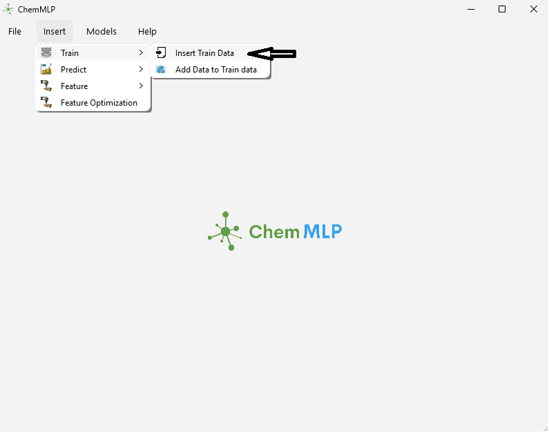
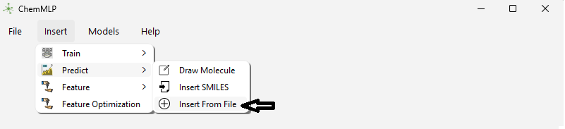
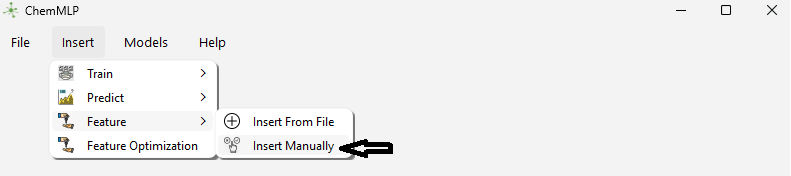
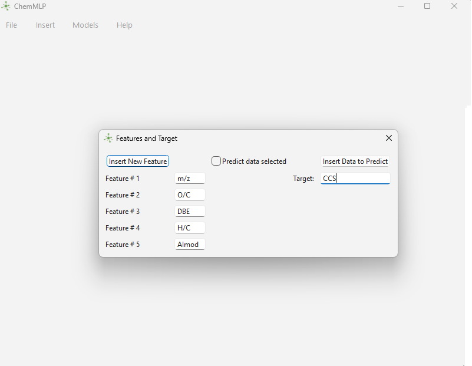
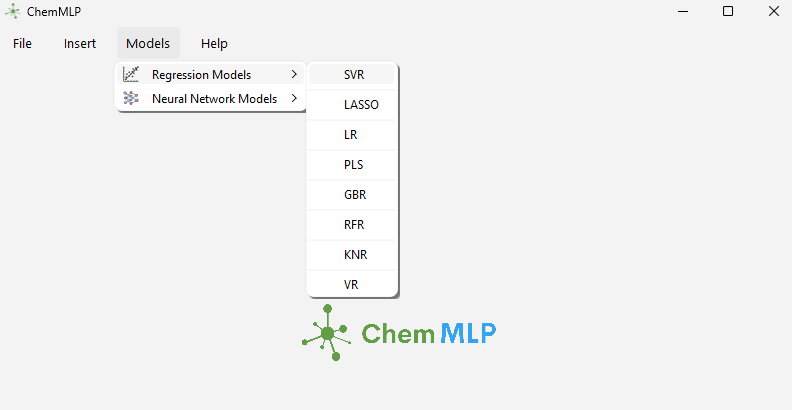
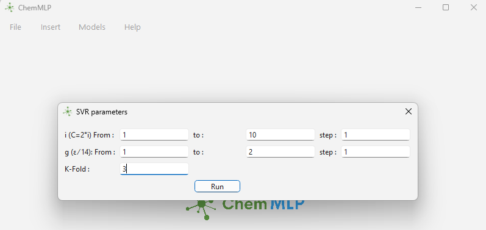
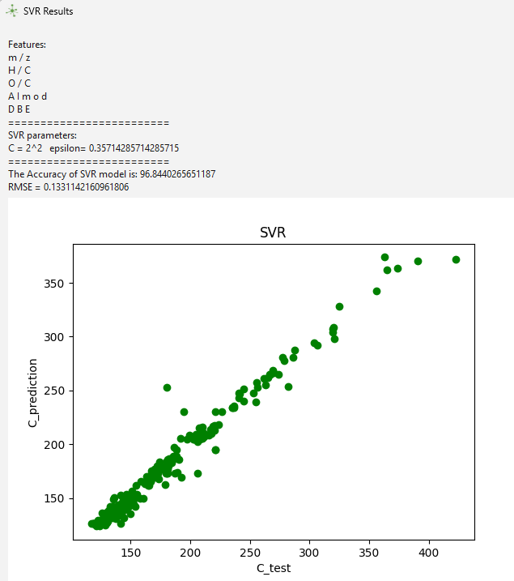

# ChemMLP: GUI for Supervised Machine Learning and Graph Neural Networks

ChemMLP is a graphical user interface (GUI) tool designed to predict molecular properties (e.g., Collision Cross-Section (CCS) values) using supervised machine learning (e.g., VR, RF, SVR, Lasso) and Graph Neural Networks (GNNs). This tool supports the manuscript submitted to JASMS (Ebrahimi, S., et al., 2025).
- This guide provides instructions for uploading data, selecting a model, and obtaining results. Additional features are available in the software but are not detailed here. The software is currently under development to include further enhancements.

## Downloads
- **Executable**: Download `ChemMLP.exe` from [Releases](https://github.com/ahvan77/ChemMLP-V1.0/releases/latest) for Windows.
- **Unzip**: The executable file and 'Data' folder (~500MB) are split into parts and stored in the [Zip File directory](https://github.com/ahvan77/ChemMLP-V1.0/tree/main/Zip%20File). Download all `ChemMLP_part.zip*` files:
  1. Visit the [Zip File directory](https://github.com/ahvan77/ChemMLP-V1.0/tree/main/Zip%20File).
  2. Download each `ChemMLP_part.zip*` file (e.g., `ChemMLP_part.zip`, `Data_examples_part.zip002`, etc.).
  3. Combine the files using 7-Zip or WinRAR:
     - Install 7-Zip from [https://www.7-zip.org/](https://www.7-zip.org/) or download WinRAR.
     - Place all downloaded parts in a single folder on your computer.
     - Right-click `ChemMLP_part.zip` > 7-Zip or WinRAR > "Extract Here".
     - This will recreate the original `ChemMLP.zip` containing the 'Data' folder with example datasets (e.g., carbohydrates).
- **Extract File**: After combining, extract `ChemMLP.zip` to access the executable file and the 'Data' folder, which includes an example dataset for carbohydrates.
- **Execute File**: Run `ChemMLP.exe`.

## Usage Guide with Figures

### 1. Opening Training and Prediction Files
- Launch `ChemMLP.exe` to view the main interface (Figure 1).
- Go to `Insert > Train` to load a training dataset (e.g., `carbohydrate_dataset.csv` from the `Data` folder).
- **Figure 1**: Main GUI window showing the menu bar.
  
- Use `Insert > Predict` to load a prediction file with the same feature structure.
- **Figure 2**: Dialog for selecting a training CSV file.
  
- Use `Insert > Features` to add features and the target.
- **Figure 3**: Feature selection interface.
  

### 2. Inserting Features
- After the feature selection interface opens, another interface appears to specify features and the target. In this example, the features are m/z, H/C, O/C, AImod, and DBE, and the target is CCS.
- **Figure 4**: Feature and target selection interface with columns highlighted.
  

### 3. Selecting a Model (Regression or NN)
- Navigate to the `Models` menu to choose a model type.
- Options include:
  - **Regression Models**: VR, RF, SVR, Lasso.
  - **Neural Networks**: GNN (for SMILES-based data).
- **Figure 5**: `Models` menu with regression and NN options.
  
  - Select `Models > Regression Models > SVR` for this example and enter the range of parameters (**Figure 6**).
  - 

### 4. Example Results with SVR Regression
- View the results (e.g., predicted vs. actual CCS values) in the output panel.
- **Figure 6**: SVR regression results showing a plot or table of predictions.
  

### 5. Saved Data
- The predicted target and output results will be saved in the same directory.

## Citation (Will be updated)
Ebrahimi, S., et al. (2025). Supervised Machine Learning and Graph Neural Networks to Predict Collision Cross-Section Values of Aquatic Dissolved Organic Compounds. 
## Contact
sa.ebrahimi@gmail.com

## License
[MIT License](LICENSE)
