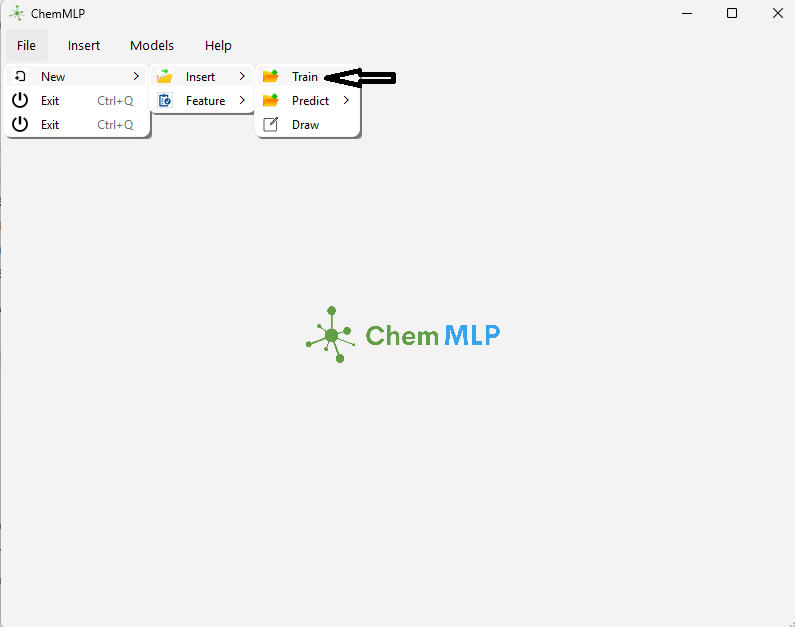

# ChemMLP: GUI for Supervised Machine Learning and Graph Neural Networks

ChemMLP is a graphical user interface (GUI) tool for predicting molecular properties (e.g., Collision Cross-Section (CCS) values) using supervised machine learning (e.g., VR, RF, SVR, Lasso) and Graph Neural Networks (GNNs). This tool supports the manuscript submitted to JASMS (Ebrahimi, S., et al., 2025).
- In this instruction we have provided the method to upload data and choose a model and get the results. There are more options with this software which is not explained here. However, the software is in progress to add other features.

## Downloads
- **Executable**: Download `ChemMLP.exe` from [Releases](https://github.com/[yourusername]/ChemMLP/releases/latest) for Windows.
- **Sample Data**: Download `Data_examples.zip` from Releases for molecule class datasets (e.g., carbohydrates, hydrocarbons).

## Installation
1. Download and run `ChemMLP.exe` (no Python required).
2. For source: Clone repo, install dependencies via `pip install -r requirements.txt`.

## Usage Guide with Figures

### 1. Opening Training and Prediction Files
- Launch `ChemMLP.exe` to see the main interface (Figure 1).
- Go to `File > New > Insert > Train` to load a training dataset (e.g., `carbohydrate_dataset.csv` from `Data_examples.zip`).
- Use `File > New > Insert > Predict` to load a prediction file with the same feature structure.
- **Figure 1**: Main GUI window showing the menu bar.
  
- **Figure 2**: Dialog for selecting a training CSV file.
  

### 2. Inserting Features
- After loading a dataset, select features (e.g., molecular descriptors) and the target (e.g., CCS) in the feature selection interface.
- Click `Insert` to confirm feature columns (e.g., SMILES, mass, etc.).
- **Figure 3**: Feature selection interface.
  
- **Figure 4**: Feature and target selection interface with columns highlighted.
  

### 3. Selecting a Model (Regression or NN)
- Navigate to the `Models` menu to choose a model type.
- Options include:
  - **Regression Models**: VR, RF, SVR, Lasso.
  - **Neural Networks**: GNN (for SMILES-based data).
- **Figure 4**: `Models` menu with regression and NN options.
  
  - Select `Models > Regression Models > SVR` for this example and insert the range of parameters (**Figure 5**).
  - 

### 4. Example Results with SVR Regression
- After selecting SVR, click `Train` to fit the model on the training data.
- View results (e.g., predicted vs. actual CCS values) in the output panel.
- **Figure 5**: SVR regression results showing a plot or table of predictions.
  

## Citation
Ebrahimi, S., et al. (2025). Supervised Machine Learning and Graph Neural Networks to Predict Collision Cross-Section Values of Aquatic Dissolved Organic Compounds. Submitted to Journal of the American Society for Mass Spectrometry (JASMS).

## Contact
sa.ebrahimi@gmail.com

## License
[MIT License](LICENSE)
